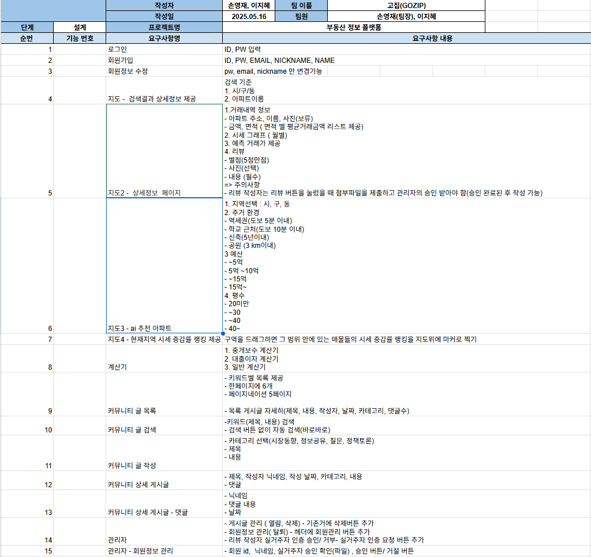

# 🏠 GoZip - 부동산 거래 정보 플랫폼

600만개의 거래정보 데이터를 활용하여 다양한 정보를 제공받을 수 있습니다. 

Spring Boot와 Vue.js 기반의 부동산 지도 서비스 프로젝트입니다.

## 📌 프로젝트 개요

- **프로젝트명**: GoZip (고집)
- **기간**: 2025.05.21 ~ 2025.05.28
- **팀원**: [이름1], [이름2], ...
- **주요기능**: 지역 기반 아파트 정보 제공, AI 추천, 사용자 커뮤니티
### 🙋‍♂️ Team members

| |
|:---:|:---:|
|[이지혜](https://github.com/Jihye511) |[손영재](https://github.com/oz115) |
|카카오 지도 연결  ai 추천 및 지도 연동    건물 시세 시각화    커뮤니티  | 👑 **PM**   회원정보   지도 내 범위 검색   건물별 리뷰 및 평점    계산기 |
---

## 🚀 주요 기능

### ✅ 아파트 정보 탐색
- 시/군/구, 동 단위 검색
- 지도 기반 아파트 마커 및 정보 표시

### 🧠 AI 아파트 추천
- GPT 기반 조건형 추천 (예: 조용하고 학군 좋은 곳)
- 사용자 입력 기반 키워드 분석 및 추천 결과 제공

### 💬 커뮤니티 기능
- 게시글/댓글 작성 및 조회
- 사용자 간 정보 공유 가능

---

## 🛠 사용 기술

### 🔧 Backend
- **Framework**: Spring Boot
- **Database**: MySQL
- **AI 연동**: Spring AI, OpenAI GPT
- **보안**: Spring Security

### 💻 Frontend
- **Framework**: Vue.js 3 + Vite
- **지도 API**: Kakao Map API
- **상태관리**: Pinia
- **스타일링**: Tailwind CSS

### 요구사항명세서
https://docs.google.com/spreadsheets/d/1zrRtcDrmhplDt20apE999OgHi7lIRaEqgyQfeq4jJh8/edit?gid=0#gid=0

### ERD

### classdiagram

